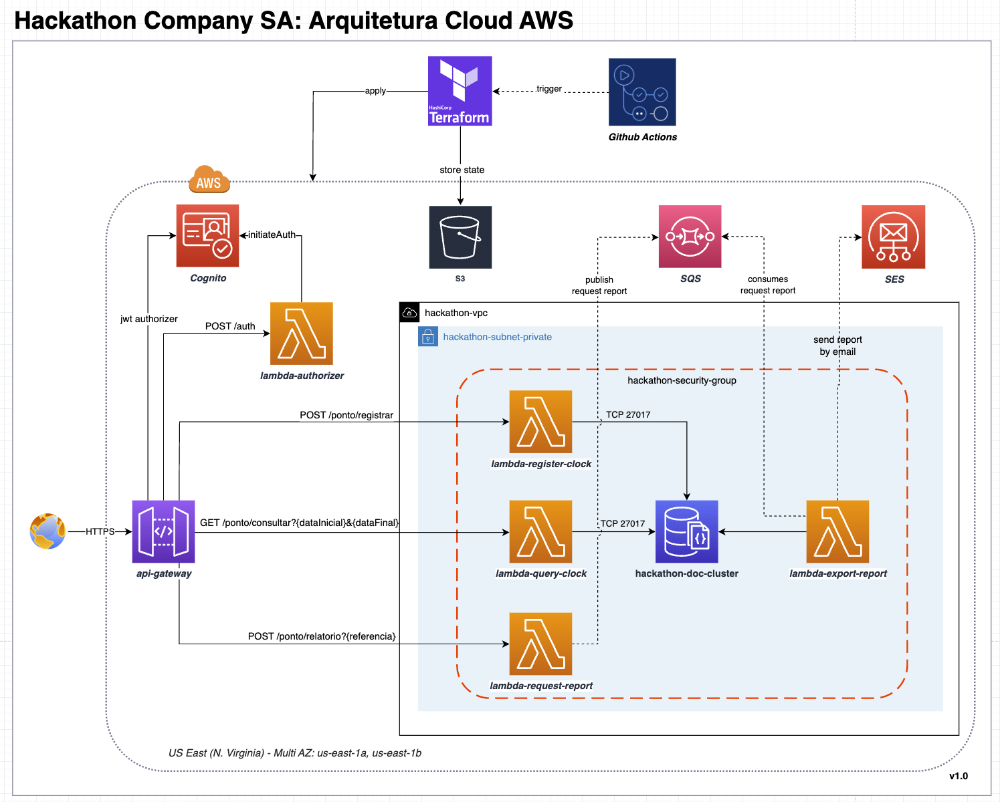
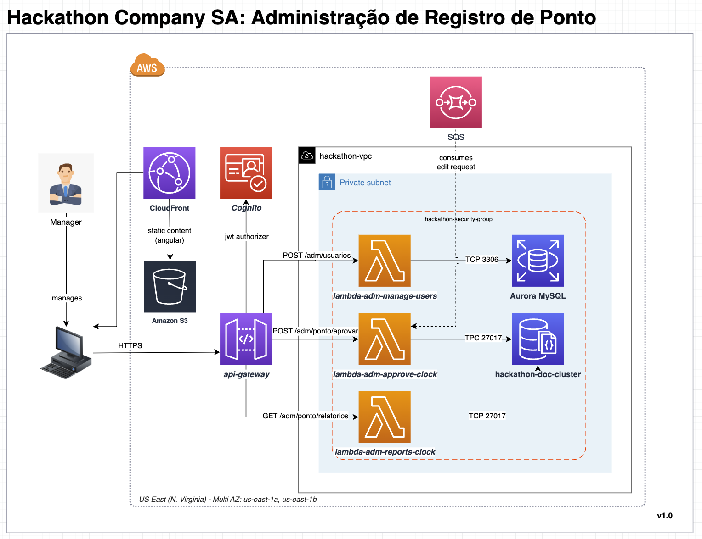
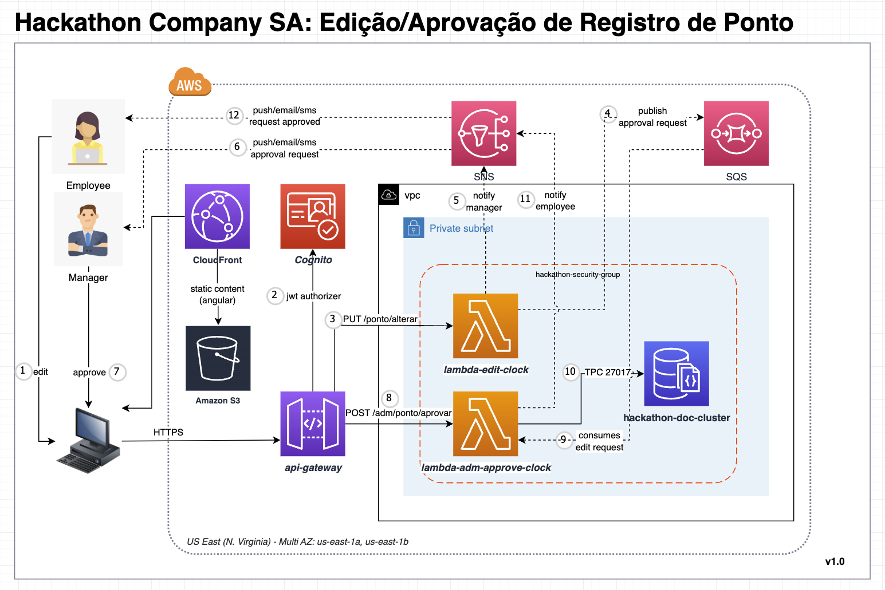
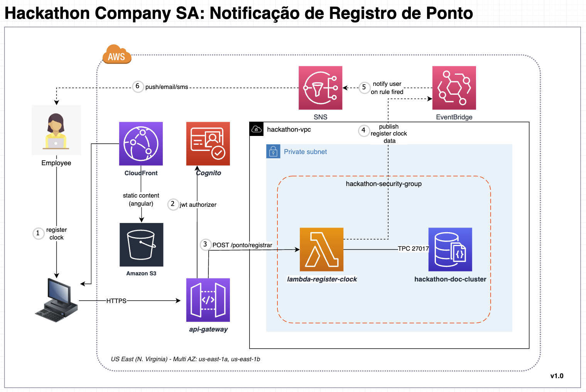
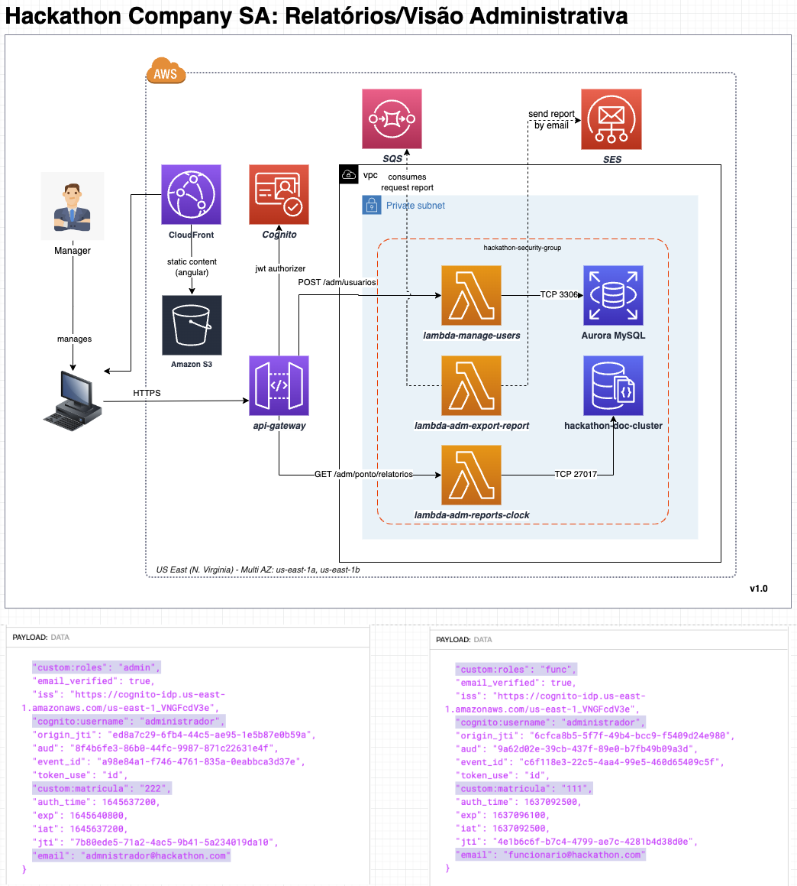

 

 

 

 

# ⏰ Hackathon Company SA  

Sistema de registro de ponto. Projeto de conclusão do hackathon da pós gradução em Software Architecture.

# Arquitetura Serverless AWS (MVP)

# Arquitetura Evolutiva Serverless AWS (Fase 02)

# Lambdas
- [Lambda de Autenticação](docs/lambda-authorizer.md)
- [Lambda de Registro de Ponto](docs/lambda-register-clock.md)
- [Lambda de Consulta de Registro de Ponto](docs/lambda-query-clock.md)
- [Lambda de Exportação de Registro de Ponto](docs/lambda-export-report.md)
- [Lambda de Requisição de Relatório](docs/lambda-request-report.md)